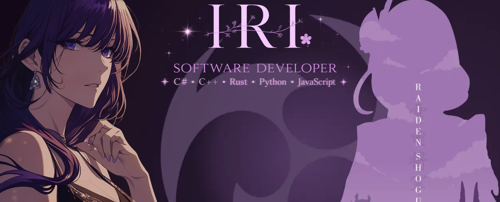

  

 

<table>
<tr>

<td width="68%" valign="top">

<h1>Hey, I'm Iri 💜</h1>

  <strong>pronounced <em>eye-ree</em></strong>

  <em>Welcome to my little corner of GitHub.</em>

 

  I enjoy creating software that helps people feel safer,
  healthier, and more in control.

  Whether it's privacy tools, wellbeing apps, or future projects still taking shape,
  I love building things that genuinely help people.

 

  <strong>
    Creating software with care, because technology should help people.
  </strong>

 

  

  

  

</td>

<td width="32%" align="center" valign="top">

  

<strong>Iri 💜</strong> 
<em> one person, many ideas </em>

</td>

</tr>
</table>

 

## 💜 A Little About Me

I’m not a company or a large development team — just one person who enjoys creating software that helps people.

Technology is a huge part of everyday life, and I believe it should make people feel safer, healthier, and more in control, not overwhelmed or taken advantage of.

That idea is what inspires many of the projects I build, from privacy-focused tools like **WebWarden** to wellbeing projects such as **Hydra Heart**.

I care a lot about thoughtful design, honest communication, and building things that genuinely provide value. If you ever have feedback, ideas, questions, or simply want to say hello, you're always welcome to reach out.

After all, behind every project is a real person — and this little corner of GitHub is mine. 💜

 

 

  

 

<h2 align="center">💜 Why I Became a Developer & My Ideals</h2>

  <em>Software, to me, is more than code. It's creation, protection, and care.</em>

 

<table>
<tr>

<td width="35%" align="center" valign="top">

  

<strong>Iri's Ideals</strong> 
<em>useful • honest • protective • human</em>

  

I build because I care. 
I improve because I listen. 
I create because software can be art.

</td>

<td width="65%" valign="top">

<h3>💜 Why I build</h3>

I didn't become a developer just to make money, chase trends, or build things for the sake of building them.
I became a developer because I like being useful.

I enjoy solving problems, whether that means fixing a bug, helping someone with an issue, or finding a better way to do something.
There is something incredibly rewarding about taking a problem that feels stuck and finally making it work.

I also love learning. I never want to stop growing, improving, and discovering better ways to create things.
To me, software is a form of art: taking an idea from your head and turning it into something real that people can actually use.

<h3>💜 What I stand against</h3>

A lot of modern software frustrates me. Too much of it feels soulless, corporate, and built around profit instead of people.
Apps are designed to keep users scrolling, tracking is everywhere, adverts follow people around, and trust is often treated like something to exploit.

I never want to become the kind of developer who fills everything with ads, microtransactions, subscriptions, and manipulative design just to squeeze money out of people.
Software should help users, not use them.

<h3>💜 What I want to build</h3>

I want my software to be easy enough for almost anyone to understand, but still genuinely effective.
If something claims to protect people, it should actually protect them.
All the trust in the world is useless if the software doesn't do its job.

That's why privacy, safety, and protection matter so much to me.
I hate scammers, malware, tracking, and anything that takes advantage of people online.
If I could magically make hacking, scams, phishing, and malware stop working forever, I would.

Part of me also enjoys sticking it to the companies that treat people like products.
Building software that puts users first feels like pushing back in my own small way.

<h3>💜 How I want to grow</h3>

I don't expect everyone to love everything I build. If someone stops using one of my projects, I'd rather understand why than be blindly praised.
Constructive feedback helps me improve, and improvement matters more to me than ego.

One day, I hope to become the kind of developer people can learn from, respect, and trust.
Not because I'm perfect, but because I care about doing things properly.

<strong>
At the end of the day, if someone visits my profile, uses one of my projects, and thinks:
<em>"She really cares about people."</em>
then I've achieved what I set out to do.
</strong>

</td>

</tr>
</table>

 

 

  

<h2 align="center">🌸 Current Creations</h2>

  The projects currently occupying my mind.

 

<table>
<tr>

<td width="50%" align="center" valign="top">

<h3>💜 WebWarden</h3>

WebWarden began from a simple belief:
<strong>people deserve to feel safer on the internet.</strong>

Built around privacy, protection, and user control, WebWarden is my attempt to make the internet feel safer without overwhelming people.

The web can be dangerous, confusing, and full of things designed to track, trick, or take advantage of users.
WebWarden brings together the protections I wish browsers had by default.

From tracker blocking and redirect protection to download safety and privacy-focused tools, every feature exists for one reason:
<strong>helping people stay safer and more in control online.</strong>

 

</td>

<td width="50%" align="center" valign="top">

<h3>💜 Hydra Heart</h3>

Hydra Heart began from a simple belief:
<strong>taking care of yourself should be easier.</strong>

Focused on hydration, wellbeing, and healthy habits, Hydra Heart encourages people through gentle reminders instead of guilt or pressure.

A lot of people forget to drink enough water, even though it is one of the simplest ways to take better care of yourself.
Hydra Heart is built to make that habit feel easier, softer, and more consistent.

I believe healthy habits should be accessible to everyone. Looking after yourself should not require a subscription, which is why Hydra Heart is built to stay
<strong>simple, helpful, and free.</strong>

 

</td>

</tr>
</table>

 

 

<table>
<tr>

<td width="35%" align="center" valign="top">

  

<strong>Beyond The Code</strong> 
<em>soft things, quiet ideas, and little inspirations</em>

</td>

<td width="65%" valign="top">

<h2>💜 Beyond The Code</h2>

Software is a huge part of my life, but it isn't the only thing that inspires me.
A lot of my ideas come from the things I enjoy outside of programming.

I love purple aesthetics, thoughtful design, character-driven games, art, creativity,
and learning new things. Those interests often shape the way I think about the projects I build.

When I'm not coding, I'm usually exploring ideas, improving something, designing something,
or thinking about how small details can make something feel more personal.

 

  💜 Purple aesthetics 
  🎮 Genshin Impact & Wuthering Waves 
  🎸 Guitar 
  🎨 Art and drawing 
  💻 Computers and technology 
  ✨ Learning new things

</td>

</tr>
</table>

 
