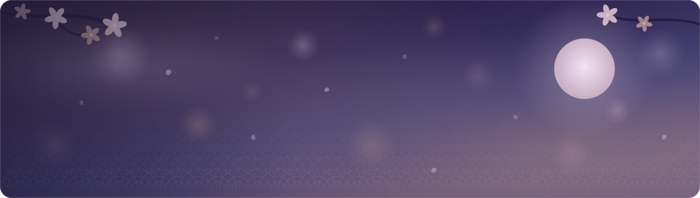
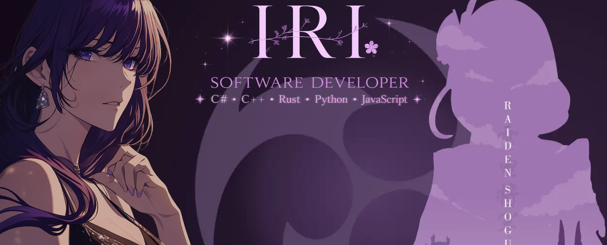
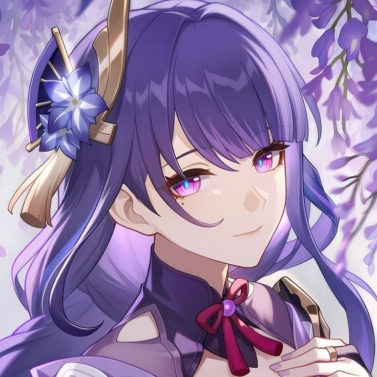

  

 

<!-- Old banner kept in the repo:  -->

<table>
<tr>

<td width="68%" valign="top">

<h1>Hey, I'm Iri 💜</h1>

  <strong>pronounced <em>eye-ree</em></strong>

  <em>Welcome to my little corner of GitHub.</em>

 

  I recently finished my degree in software engineering and cyber security.
  Now I use it out in the open, making software that helps people feel safer,
  healthier, and more in control.

  Whether it's privacy tools, wellbeing apps, or future projects still taking shape,
  I love building things that genuinely help people.

 

  <strong>
    Creating software with care, because technology should help people.
  </strong>

 

  

  

  

</td>

<td width="32%" align="center" valign="top">

  

<strong>Iri 💜</strong> 
<em> one person, many ideas </em>

</td>

</tr>
</table>

 

  

## 💜 A Little About Me

I’m not a company or a large development team — just one person who enjoys creating software that helps people.

Technology is a huge part of everyday life, and I believe it should make people feel safer, healthier, and more in control, not overwhelmed or taken advantage of.

That idea is what inspires many of the projects I build, from privacy-focused tools like **WardenOne** to wellbeing projects such as **Hydra Heart**.

I care a lot about thoughtful design, honest communication, and building things that genuinely provide value. If you ever have feedback, ideas, questions, or simply want to say hello, you're always welcome to reach out.

After all, behind every project is a real person — and this little corner of GitHub is mine. 💜

 

  

## 💜 On Earning Your Trust

I studied software engineering and cyber security together. It sounds like two subjects, but it always felt like one: how to build things properly, and how they get broken. You really do need both.

I also know that asking someone to install software that protects them is asking for a lot of trust, and I haven't earned that yet. I'm new, I don't have many followers, and there's no long track record to point at. I'd rather say that plainly than pretend otherwise.

So here is my promise, and it isn't going to change. Everything I make will always be open source and free to inspect. Every line of code, every permission it asks for, every request it makes. You should never have to take my word for it, because you can go and look.

I'd rather earn trust slowly than ask for it up front. And if you ever find something I've got wrong, please tell me. I'd genuinely like to know. 💜

 

 

  

 

<h2 align="center">💜 Why I Became a Developer & My Ideals</h2>

  <em>Software, to me, is more than code. It's creation, protection, and care.</em>

 

<table>
<tr>

<td width="35%" align="center" valign="top">

  

<strong>Iri's Ideals</strong> 
<em>useful • honest • protective • human</em>

  

I build because I care. 
I improve because I listen. 
I create because software can be art.

</td>

<td width="65%" valign="top">

<h3>💜 Why I build</h3>

I didn't become a developer just to make money, chase trends, or build things for the sake of building them.
I became a developer because I like being useful.

I enjoy solving problems, whether that means fixing a bug, helping someone with an issue, or finding a better way to do something.
There is something incredibly rewarding about taking a problem that feels stuck and finally making it work.

I also love learning. I never want to stop growing, improving, and discovering better ways to create things.
To me, software is a form of art: taking an idea from your head and turning it into something real that people can actually use.

<h3>💜 What I stand against</h3>

A lot of modern software frustrates me. Too much of it feels soulless, corporate, and built around profit instead of people.
Apps are designed to keep users scrolling, tracking is everywhere, adverts follow people around, and trust is often treated like something to exploit.

I never want to become the kind of developer who fills everything with ads, microtransactions, subscriptions, and manipulative design just to squeeze money out of people.
Software should help users, not use them.

<h3>💜 What I want to build</h3>

I want my software to be easy enough for almost anyone to understand, but still genuinely effective.
If something claims to protect people, it should actually protect them.
All the trust in the world is useless if the software doesn't do its job.

That's why privacy, safety, and protection matter so much to me.
I hate scammers, malware, tracking, and anything that takes advantage of people online.
If I could magically make hacking, scams, phishing, and malware stop working forever, I would.

Part of me also enjoys sticking it to the companies that treat people like products.
Building software that puts users first feels like pushing back in my own small way.

<h3>💜 How I want to grow</h3>

I don't expect everyone to love everything I build. If someone stops using one of my projects, I'd rather understand why than be blindly praised.
Constructive feedback helps me improve, and improvement matters more to me than ego.

One day, I hope to become the kind of developer people can learn from, respect, and trust.
Not because I'm perfect, but because I care about doing things properly.

<strong>
At the end of the day, if someone visits my profile, uses one of my projects, and thinks:
<em>"She really cares about people."</em>
then I've achieved what I set out to do.
</strong>

</td>

</tr>
</table>

 

  

<table>
<tr>

<td width="21%" align="center" valign="top">

</td>

<td colspan="3" rowspan="6" valign="top">

<h2>🌸 Current Creations</h2>

  The projects currently occupying my mind.

  One is finished and out in the world, the other is still taking shape. Both come from
  the same place: software should look after the person using it.

  One protects people from things they never asked for. The other reminds them to look
  after themselves. Different problems, same instinct.

  They're built the same way, too. Slowly, in the open, and released when I'm happy with
  them rather than when they're technically finished.

  
  &nbsp;
  

 

  💜 <strong>Currently</strong>

  Building <strong>WardenOne</strong> 
  Designing <strong>Hydra Heart</strong> 
  Learning more <strong>C#</strong> 
  Drinking slightly too much caffeine ☕

  
    and probably telling myself
    "just one more feature" again...
  

</td>

</tr>
<tr><td align="center"><em>the one doing the building 💜</em></td></tr>
<tr><td>🌸 <strong>Projects</strong> — WardenOne · Hydra Heart</td></tr>
<tr><td>🧪 <strong>Status</strong> — one live, one in progress</td></tr>
<tr><td>💜 <strong>For</strong> — people, not metrics</td></tr>
<tr><td>✨ <strong>Cost</strong> — free, and staying free</td></tr>
<tr>

<td colspan="2" width="37%" align="center" valign="top">

<h3>💜 WardenOne</h3>

WardenOne began from a simple belief:
<strong>people deserve to feel safer on the internet.</strong>

Built around privacy, protection, and user control, WardenOne is my attempt to make the internet feel safer without overwhelming people.

The web can be dangerous, confusing, and full of things designed to track, trick, or take advantage of users.
WardenOne brings together the protections I wish browsers had by default.

From tracker blocking and redirect protection to download safety and privacy-focused tools, every feature exists for one reason:
<strong>helping people stay safer and more in control online.</strong>

In practice that means ad and tracker blocking, anti-fingerprinting, phishing and scam
detection, protection for your passwords and card details, download scanning, and IP-leak
protection. Over 80 of them, and every single one can be switched off if you disagree with it.

It all runs on your own device. No account, no telemetry, nothing phoning home.
I don't want your data, and the simplest way to prove that is to never collect any.

 

</td>

<td colspan="2" width="37%" align="center" valign="top">

<h3>💧 Hydra Heart</h3>

<em>Still being built — coming soon. 💜</em>

Hydra Heart began from a simple belief:
<strong>taking care of yourself should be easier.</strong>

Focused on hydration, wellbeing, and healthy habits, Hydra Heart encourages people through gentle reminders instead of guilt or pressure.

A lot of people forget to drink enough water, even though it is one of the simplest ways to take better care of yourself.
Hydra Heart is built to make that habit feel easier, softer, and more consistent.

In practice that means reminders you can shape around your own day, a simple way to keep
track without it becoming another chore, and a nudge that stays kind when life gets in the way.

There are no streaks to lose and nothing to feel guilty about if you miss a day.
I would rather build something you are glad to see than something that pressures you into opening it.

I believe healthy habits should be accessible to everyone. Looking after yourself should not require a subscription, which is why Hydra Heart is built to stay
<strong>simple, helpful, and free.</strong>

 

</td>

</tr>
</table>

  

 

<h2 align="center">💜 Beyond The Code</h2>

  The little things that make me, me.

 

<table>
<tr>

<td width="35%" align="center" valign="top">

  

<h3>💜 A Few Things About Me</h3>

<em>life outside the code</em>

 

I think the things we love 
quietly shape the things 
we create.

 

There is more to life than code, 
and I think that's what makes 
creating things meaningful.

</td>

<td width="65%" valign="top">

<h3>💜 Favourite Colour</h3>

Purple. I genuinely think purple can make almost anything look better.

<h3>💜 Games & Stories</h3>

Genshin Impact, Wuthering Waves, and Steins;Gate. I love worlds that feel alive and stories that stay with you long after you've finished them.

<h3>💜 Flowers & Nature</h3>

I love flowers, nature, and peaceful scenery. There's something calming about them that I don't think technology can replace.

<h3>💜 Music</h3>

Almost everything. Except screamo. We're not doing that.

<h3>💜 Creative Interests</h3>

Art, design, guitar, cooking, and making things feel personal. I like creating things in more ways than just writing code.

<h3>💜 Space & Gemstones</h3>

I've always loved space, stars, gemstones, and things that feel a little magical.

<h3>💜 Self Care</h3>

Skincare, haircare, and small routines that make life feel softer and more put together.

<h3>💜 Something I Want To Learn</h3>

I'd love to learn another language one day — and for once, I don't mean a programming language.

</td>

</tr>
</table>

 

  

 

<table>
<tr>

<td width="68%" valign="top">

<h1>💜 Languages & Tools</h1>

  The tools I use to turn ideas into something real.

 

  Every project starts with something small: an idea, a problem to solve,
  or something I wish existed.

  I don't care about chasing every trend. I care about learning the tools
  that help me build things properly, improve over time, and create software
  that feels useful.

 

<h3>💜 What I Build With</h3>

  
  &nbsp;
  
  &nbsp;
  
  &nbsp;
  
  &nbsp;
  
  &nbsp;
  
  &nbsp;
  
  &nbsp;
  
  &nbsp;
  
  &nbsp;
  

 

<h3>💜 How I Think About Them</h3>

  <strong>C#</strong> is where a lot of my bigger ideas begin, especially when I want to build something that feels like a real application.

  <strong>Java</strong> is where a lot of the fundamentals clicked for me. It makes you say exactly what you mean, which is irritating right up until the moment it saves you.

  <strong>JavaScript</strong>, HTML, and CSS help me build for the browser, which makes them especially important for projects like <strong>WardenOne</strong>.

  <strong>TypeScript</strong> is the same thing with the guard rails on. Once something grows past a few files, I'd rather my editor catch the mistake than my users.

  <strong>Python</strong> is perfect for experiments, quick tools, testing ideas, and getting something working fast.

  <strong>Rust</strong> pushes me to think more carefully about safety, structure, and performance.

  <strong>C</strong> is the one that shows you what every other language has been doing for you. Nothing is hidden, which is equal parts useful and unnerving.

  <strong>C++</strong> is powerful, interesting, and sometimes extremely annoying — but I respect it.

 

<h3>💜 Where Security Fits</h3>

  <strong>Security</strong> isn't in the list above, because it isn't a language.
  It's the other half of my degree, and it follows me into every language that is.

  What it really changed is the question I ask about my own work. You stop asking only
  whether something works, and start asking what happens when someone tries to misuse it.

 

<h3>💜 Daily Tools</h3>

<table>
<tr>
<td width="15%" align="center"></td>
<td width="35%"><strong>VS Code</strong> most of the writing</td>
<td width="15%" align="center"></td>
<td width="35%"><strong>Git</strong> every change, kept</td>
</tr>
<tr>
<td align="center"></td>
<td><strong>Visual Studio</strong> the bigger C# builds</td>
<td align="center"></td>
<td><strong>GitHub</strong> where it all ends up</td>
</tr>
</table>

  Most of my time is spent building, testing, breaking things by accident,
  fixing them again, and slowly turning ideas into real projects.

 

  <strong>
    The languages will change. The tools will change.
    The goal stays the same: build things that genuinely help people.
  </strong>

</td>

<td width="32%" align="center" valign="top">

  

<h3>💜 My Toolkit</h3>

  <em>tools, languages, and little experiments</em>

 

  I like learning tools that help me 
  build cleaner, safer, and more useful 
  software.

 

  Some are for big projects. 
  Some are for quick ideas. 
  Some are just because 
  I wanted to understand them.

</td>

</tr>
</table>

 

  

  

 

<h2 align="center">💜 Side Notes</h2>

  <em>little thoughts from behind the screen</em>

 

  💜 Some projects have been fuelled by questionable amounts of caffeine.

 

  💜 My sleep schedule and programming are not always on speaking terms.
   
  <em>"One more feature" rarely means one more feature.</em>

 

  💜 I have a talent for breaking things that were working perfectly five minutes ago.
   
  <em>I'm still not sure how.</em>

 

  💜 Most projects begin as a random idea I can't stop thinking about.
   
  <em>Some ideas are quiet. Some refuse to leave me alone.</em>

 

  ˚₊‧꒰ა ───── 💜 ───── ໒꒱‧₊˚

 

  

 

<table>
<tr>

<td width="38%" align="center" valign="top">

  

<h3>💜 A Small Invitation</h3>

  <em>my inbox is always open</em>

 

  If you've made it this far,
  thank you for stopping by.

 

  Whether you have feedback,
  a question,
  an idea,
  or simply want to say hello,
  you're always welcome here.

 

  I'll do my best to reply.

  <em>Don't be a stranger. 💜</em>

</td>

<td width="62%" valign="top">

<h2>💜 Send Me A Message</h2>

  If one of my projects helped you,
  confused you,
  broke on your computer,
  inspired an idea,
  or simply made you curious,
  I'd genuinely love to hear from you.

  Some of my favourite improvements,
  conversations,
  and ideas have started because somebody decided to send a message.

  I read my emails personally,
  check my messages myself,
  and always try to respond when I can.

  Questions,
  suggestions,
  bug reports,
  feedback,
  project ideas,
  or even a random hello are all welcome.

  Behind every project is a real person.

  And I'd be happy to hear from you. 💜

 

<h3>💜 If You'd Like To Say Hello</h3>

  💌 <strong>Email</strong> 
  <a href="mailto:iri.devsupport@gmail.com">
    iri.devsupport@gmail.com
  </a>

  💜 <strong>Discord</strong> 
  <code>iri.dev</code>

 

  I check both personally,
  and I'd genuinely love to hear from you.

  Choose whichever feels most comfortable and natural to you —
  both are perfectly welcome.

  A thoughtful email,
  a quick Discord message,
  or even just a simple hello.

  They're all welcome here. 💜

 

</td>

</tr>
</table>

 

 

  

  

<h2 align="center">💜 Thank You For Visiting</h2>

  <em>thank you for spending a little time in my corner of GitHub</em>

  If you've made it all the way down here, thank you.

  Whether you came for a project, found something useful, or simply stopped by out of
  curiosity, I'm genuinely glad you were here.

  Every person who uses something I've built, leaves feedback, sends a message, or
  supports my work means more to me than you might realise.

  ☕ Everything I make stays free. If you'd like to help anyway, there's a tip jar.

  <!-- Paste your Buy Me a Coffee URL as an href around this badge to make it a link. -->
  

  <em>take care, and keep creating</em>

<h3 align="center">💜 Iri</h3>

  <em>one person, many ideas</em>

 

 
